# Data Analysis: Google Sheets
## Bootcamp WoMakersCode 2023 + Alura
O repositório contém um resumo do aprendizado referente ao curso da Alura sobre análise de dados com Google Sheets.

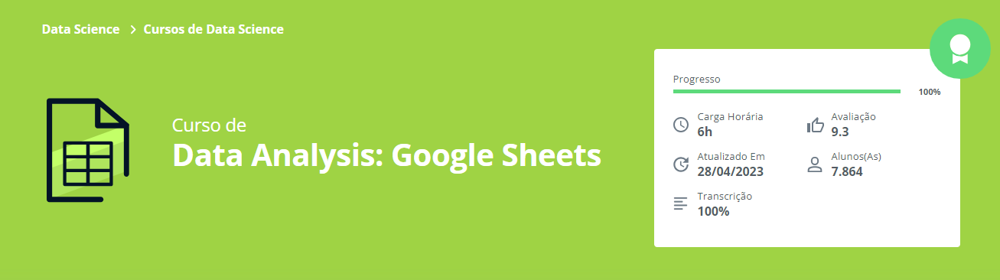

- A ferramenta que utilizada no curso foi o **Google Sheets**, para quem não sabe o Google Sheets ou, simplesmente, Google Planilhas é como se fosse uma versão online do Excel.
Dessa maneira, a ferramenta é ideal para fazer cálculos, agendas, cronogramas, lista de tarefas, escalas de trabalho e muito mais.
Também é possível mexer nela de maneira online ou offline e, ainda, é possível receber a colaboração de outras pessoas, apenas compartilhando o link do documento.

## Atalhos do Google Sheets

- Ctrl + Alt + V   -> Cola somente a formatação
- Ctrl + Shift + Espaço   -> Seleciona todos os dados
- Ctrl + Shift + V   -> Cola apenas os valores

## Módulo 1 - Base no Google Sheets

**Estudo de caso:** Marcela quer abrir uma livraria online, sendo assim, contrata um Analista de Dedos para que as tomadas de decisões sejam mais precisas.

O analista solicita a base com os livros comprados, quantidade, custo de cada livro e o percentual do lucro para que seja calculado o valor de venda.

Marcela envia a base com os dados, e o analista que no caso sou eu(Letícia) importa os dados para o Google Sheets e ajusta o material.

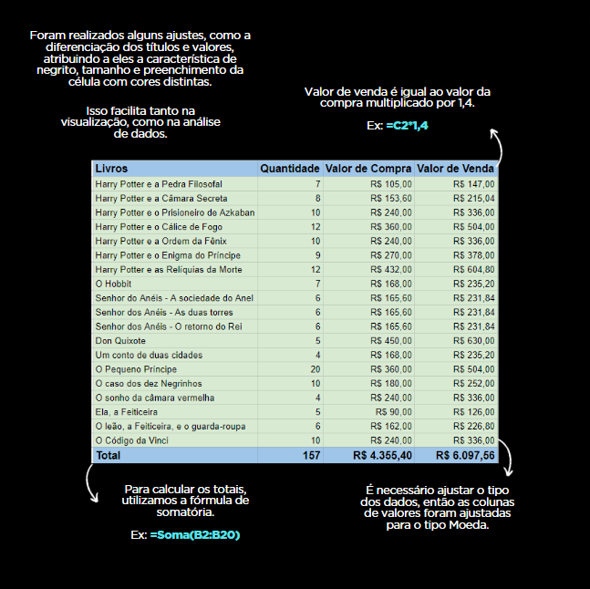

Um gráfico é adicionado para que a Marcela tenha maior facilidade em diferenciar os elementos, isso não significa que o modelo adicionado seja o melhor para esse tipo de análise, porém o objetivo no entanto é aprendermos a inserir um gráfico por meio do Google Sheets. Em seguida veremos as diferenças entre os tipos de gráficos e quando usa-los.

Para inserir um gráfico, selecione os dados da tabela e siga os passos abaixo:

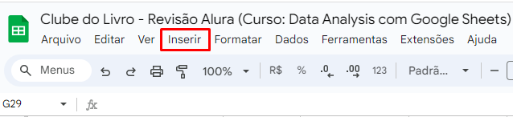

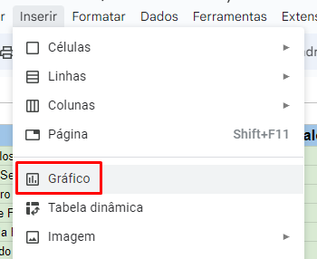

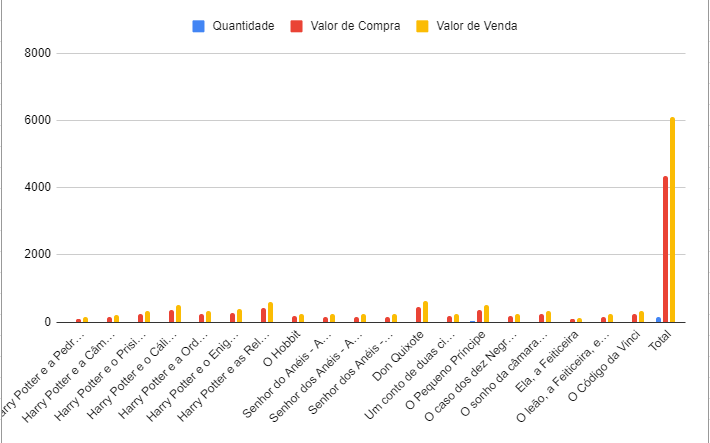

O Google Sheets adiciona o modelo de gráfico de maneira automática, sendo assim podemos modificar. É preciso dar um duplo clique no gráfico para que as configurações apareçam, como mostra a imagem abaixo:

Na aba de "Configuração", clique no campo "Tipo de Gráfico" e escolha o modelo que se adéqua a sua análise.

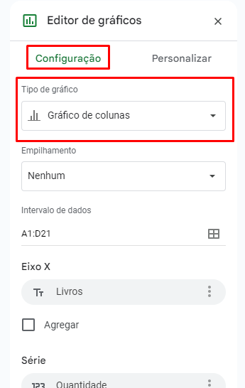

## Módulo 2 - Gráficos

- Sempre adicione títulos intuitivos para seus gráficos, assim, a maioria das pessoas que visualizarem o esquema, terão mais clareza no entendimento.

### Tipos de Gráficos
Uma das maiores dúvidas na área dos dados, é qual tipo de gráfico usar, pelo menos eu me fiz esse pergunta centenas de vezes e só agora comecei a me interar sobre o assunto.

Vou apresentar alguns modelos de gráficos e apresentar em quais situações devemos usa-los!

- ### Gráfico de Barras ou Colunas  

Para que não haja confusão entre esses dois tipos de gráfico, vale ressaltar que o **Gráfico de Barras** é na **Horizontal** e o **Gráfico de Colunas** na **Vertical**.

**Gráfico de Barras (Horizontal)**

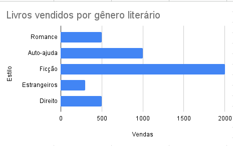

**Gráfico de Colunas (Vertical)**

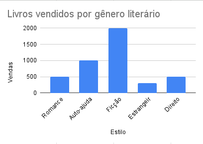

> [!IMPORTANT]
> Esse tipo de gráfico deve ser usado quando queremos comparar categorias diferentes entre si.
> Para decidir qual dos dois modelos(Barra ou Coluna) utilizar, verifique o tipo de dado que você está tratando, quantidade de texto etc. Pois pode ser que fique meio desconfigurado, por exemplo, se observarmos o gráfico plotado no Módulo 1, podemos visualizar a falta de espaço na descrição do nome dos livros.

- ### Gráfico de Pizza ou Rosca

**Gráfico de Pizza**

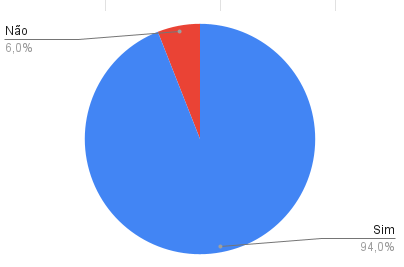

**Gráfico de Rosca**

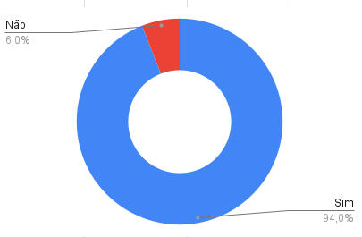

> [!IMPORTANT]
> Esses tipos de gráficos devem ser usados para analisar poucos dados. Devemos prestar atenção quando os valores são bem proxímos, pois o ser humano tem dificuldade para diferenciar o volume e área de forma intuitiva, como mostra a imagem abaixo.

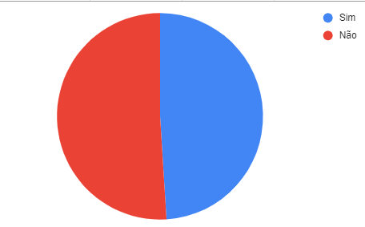

Quando olhamos para esse gráfico, é difícil saber de maneira imadiata qual área é maior.

> ### Gráfico de Linha ou Área

**Gráfico de Linha**

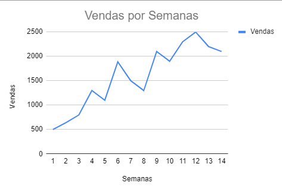

**Gráfico de Área**

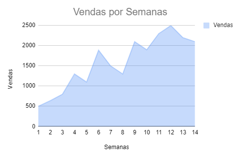

> [!IMPORTANT]
> Esses tipos de gráficos são usados para realizar análises temporais, isto é, quando os dados variam em função do tempo. Assim, conseguimos verificar as mudanças pelo comportamento da linha, conforme o andamento do período analisado.

### Primeira Análise com Gráficos

Quando temos uma base de dados, podemos adicionar outras variáveis para complementar a analise, tais como:

- Velocidade

- Aceleração