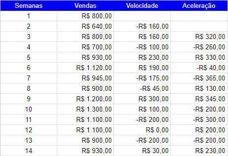
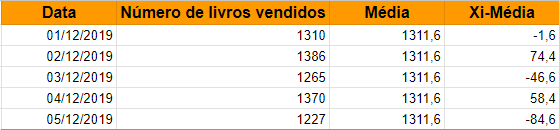

# Data Analysis: Google Sheets
## Bootcamp WoMakersCode 2023 + Alura
O repositório contém um resumo do aprendizado referente ao curso da Alura sobre análise de dados com Google Sheets.

- A ferramenta que utilizada no curso foi o **Google Sheets**, para quem não sabe o Google Sheets ou, simplesmente, Google Planilhas é como se fosse uma versão online do Excel.
Dessa maneira, a ferramenta é ideal para fazer cálculos, agendas, cronogramas, lista de tarefas, escalas de trabalho e muito mais.
Também é possível mexer nela de maneira online ou offline e, ainda, é possível receber a colaboração de outras pessoas, apenas compartilhando o link do documento.

## Atalhos do Google Sheets

- Ctrl + Alt + V   -> Cola somente a formatação
- Ctrl + Shift + Espaço   -> Seleciona todos os dados
- Ctrl + Shift + V   -> Cola apenas os valores

## Módulo 1 - Base no Google Sheets

**Estudo de caso:** Marcela quer abrir uma livraria online, sendo assim, contrata um Analista de Dedos para que as tomadas de decisões sejam mais precisas.

O analista solicita a base com os livros comprados, quantidade, custo de cada livro e o percentual do lucro para que seja calculado o valor de venda.

Marcela envia a base com os dados, e o analista que no caso sou eu(Letícia) importa os dados para o Google Sheets e ajusta o material.

Um gráfico é adicionado para que a Marcela tenha maior facilidade em diferenciar os elementos, isso não significa que o modelo adicionado seja o melhor para esse tipo de análise, porém o objetivo no entanto é aprendermos a inserir um gráfico por meio do Google Sheets. Em seguida veremos as diferenças entre os tipos de gráficos e quando usa-los.

Para inserir um gráfico, selecione os dados da tabela e siga os passos abaixo:

O Google Sheets adiciona o modelo de gráfico de maneira automática, sendo assim podemos modificar. É preciso dar um duplo clique no gráfico para que as configurações apareçam, como mostra a imagem abaixo:

Na aba de "Configuração", clique no campo "Tipo de Gráfico" e escolha o modelo que se adéqua a sua análise.

## Módulo 2 - Gráficos

- Sempre adicione títulos intuitivos para seus gráficos, assim, a maioria das pessoas que visualizarem o esquema, terão mais clareza no entendimento.

### Tipos de Gráficos
Uma das maiores dúvidas na área dos dados, é qual tipo de gráfico usar, pelo menos eu me fiz esse pergunta centenas de vezes e só agora comecei a me interar sobre o assunto.

Vou apresentar alguns modelos de gráficos e apresentar em quais situações devemos usa-los!

- ### Gráfico de Barras ou Colunas  

Para que não haja confusão entre esses dois tipos de gráfico, vale ressaltar que o **Gráfico de Barras** é na **Horizontal** e o **Gráfico de Colunas** na **Vertical**.

**Gráfico de Barras (Horizontal)**

**Gráfico de Colunas (Vertical)**

> [!IMPORTANT]
> Esse tipo de gráfico deve ser usado quando queremos comparar categorias diferentes entre si.
> Para decidir qual dos dois modelos(Barra ou Coluna) utilizar, verifique o tipo de dado que você está tratando, quantidade de texto etc. Pois pode ser que fique meio desconfigurado, por exemplo, se observarmos o gráfico plotado no Módulo 1, podemos visualizar a falta de espaço na descrição do nome dos livros.

- ### Gráfico de Pizza ou Rosca

**Gráfico de Pizza**

**Gráfico de Rosca**

> [!IMPORTANT]
> Esses tipos de gráficos devem ser usados para analisar poucos dados. Devemos prestar atenção quando os valores são bem proxímos, pois o ser humano tem dificuldade para diferenciar o volume e área de forma intuitiva, como mostra a imagem abaixo.

Quando olhamos para esse gráfico, é difícil saber de maneira imadiata qual área é maior.

> ### Gráfico de Linha ou Área

**Gráfico de Linha**

**Gráfico de Área**

> [!IMPORTANT]
> Esses tipos de gráficos são usados para realizar análises temporais, isto é, quando os dados variam em função do tempo. Assim, conseguimos verificar as mudanças pelo comportamento da linha, conforme o andamento do período analisado.

### Primeira Análise com Gráficos

Quando temos uma base de dados, podemos adicionar outras variáveis para complementar a analise, tais como:

- **Velocidade**  
Com essa informação, conseguimos ver qual a velocidade de nossos dados, o deslocamento conforme o tempo passa. O ideal é que a velocidade seja crescente, porém as vezes quando analisamos os dados eles parecem estar aumentando, porém a velocidade está baixa.

Fórmula:

v = Δs/Δt

v = velocidade  
Δs = espaço  
Δt = tempo

- **Aceleração**  
Variação da velocidade em relação ao tempo.  

Fórmula:

a = Δv/Δt

a = aceleração  
Δv = velocidade  
Δt = tempo

**Exemplo:**

### O que é um arquivo CSV?
C = Comma(vírgula)  
S = Separated(separado)  
V = Values(valores, dados)  

Arquivos CSV são frequentemente usados, devido serem mais leves e compatíveis com vários aplicativos.  
Ele aceita outros tipos de separadores, além da vírgula.  
Podemos edita-lo por meio do bloco de notas.

### Removendo dados faltantes
Quando importamos uma base de dados, podemos nos comparar com algumas células sem valor ou preenchidas com #N/D - Não Disponível ou #N/A - Not available. Nesses casos, temos algumas estratégias para preencher dados faltantes, uma delas é por meio da média.  
**Exemplo:**  

  
Podemos observar que na base o dado da  primeira coluna destacada não estava disponível,  então utilizamos a média para preenche-lo. 

  

SE() = Fórmula condicional, isto é, se uma condição for verdadeira ele retornará um valor, caso contrário, o apresenta outro resultado.  
ÉNUM() = Verifica se o tipo do valor de uma determinada célula é número.  
MÉDIA() = Calcula a média de um determinado intervalos ou campos.  

Sendo assim, na imagem acima, ele usa a fórmula de condição SE(), dentro da mesma, utiliza a fórmula ÉNUM() para representar a condição, então ele verifica se o valor de derterminada célula é do tipo numérico, se sim, significa que ela está preenchida corretamente, se não, ele deverá preencher por meio da média do campo anterior e posterior.  

Você pode se perguntar qual a necessidade de preencher esses campos, pois olhando diretamente para a base de dados, talvez eles não façam tanta diferença, mas quando vamos visualizar essas informações de outra maneira, isto é, por meio de gráficos, conseguimos observar nitidamente a difereça.  
**Exemplo:**  

  
Antes e Depois

### Medidas de dispersão  

>**Variância**  

Fórmula:

Utilizada para sabermos o quanto nossos dados estão indo para cima e para baixo, o quanto ele variam em relação a média, isto é, tendência central.  
Para calcular no Google Sheets, vamos começar pela seguinte fórmula: 

Xi - Média

Xi = um determinado valor dentro do conjunto de dados  
Média = soma de um determinado intervalo ou valores distintos, dividido pela quantidade de elementos.  

Vamos realizar esse cálculo com nossos dados.  
**Exemplo**

  
Nesse exemplo, pegamos apenas um pequeno recorte dos dados disponibilizados.

Na coluna Xi-Média, fazemos a subtração da segunda coluna(Número de livros vendidos) com a terceira(Média).  
Quando realizamos a somatória da nova coluna que acabamos de calcular(Xi-Média) o resultado é zero, então, vamos para uma segunda etapa, calcular a raiz quadrada desses valores (Xi-Média)^2.  
No Google Sheets, a fórmula que realiza o cálculo da potência é =POW()

Adicionamos mais uma coluna com a raiz quadrada de cada valor referente a coluna 4(Xi-Média).

Feito isso, vamos calcular a média da coluna (Xi-Média)2

  
Para acharmos o valor da variância, utilizamos a seguinte fórmula:

>**Desvio Padrão**  

O desvio padrão, é o que se espera que aconteça de variação em torno da média dos dados, para mais ou para menos.  
Vocês lembram que no período de eleições, quando assistimos aos noticiários, os jornalistas nos dizem que uma pesquisa foi realizada e que o candidato A tem 30% dos votos com uma **MARGEM DE ERRO** de 4%. Isso é o **DESVIO PADRÃO**, se 30% representa 1000 votos e no dia da decisão o cadidato obter 1300 votos ou 700, a pesquisa estava realmente correta, pois o número de votos ficou dentro da margem de erro, desvio padrão. Isso simboliza um resultado que já era esperado.

No Google Sheets, para acharmos o desvio padrão do exemplo iniciado acima, é necessário apenas tirar da raiz o valor da variância.

Nós fizemos o passo a passo do cálculo da variância e do desvio padrão, e isso é necessário para entendermos como funciona cada parte do cálculo, porém, no Google Sheets há fórmulas que calculam essas variáveis de maneira direta.  

**Variância** -> **=VARP()**  
**Desvio Padrão** -> **=DESVPAD()**

A fórmula de desvio padrão tem uma diferença no resultado comparando com o cálculo feito passo a passo, porém é algo mínimo, então não consideramos relevante.

Observe na imagem abaixo, os resultados da Variância e Desvio Padrão da base de dados do exemplo, realizados de maneira direta:

